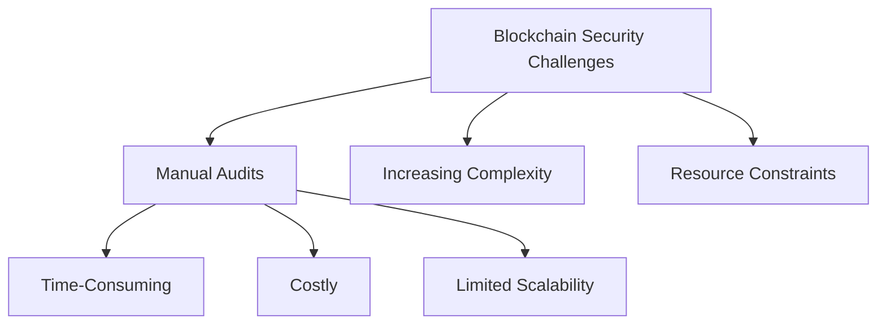
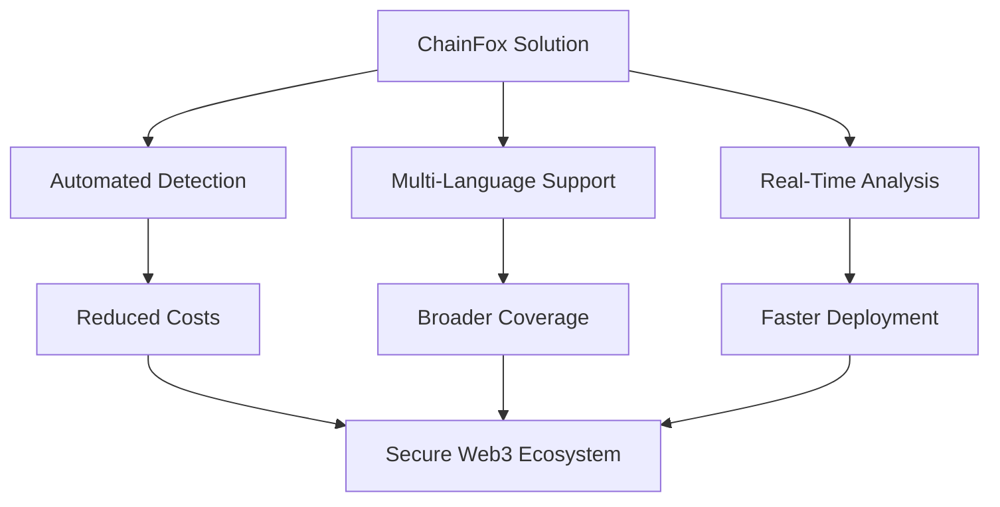

## Revolutionizing Blockchain Security Through Automated Vulnerability Detection

### 1.1 Introduction

The blockchain industry has experienced exponential growth, driving the adoption of decentralized applications and smart contracts that redefine trust and transparency in digital ecosystems. However, the increasing complexity of blockchain systems presents significant security challenges. Traditional manual security audits, while effective, are resource-intensive, time-consuming, and costly, creating barriers to rapid and secure smart contract deployment. With vulnerabilities in smart contracts potentially leading to substantial financial losses and reputational harm, there is a critical need for scalable, efficient, and reliable security solutions.

**ChainFox** addresses these challenges by introducing a comprehensive, automated security platform designed to strengthen blockchains and smart contracts. Powered by advanced detection engines, ChainFox delivers real-time vulnerability analysis across a wide range of programming languages used in blockchain development. By automating the auditing process, the platform significantly reduces costs, accelerates deployment timelines, and enhances the accessibility of robust security measures for developers and organizations.

The efficiency gain of ChainFox's automated approach can be represented as:

$$E = \frac{T_m}{T_a} \times \frac{C_m}{C_a}$$

Where:
- $E$ = Efficiency multiplier
- $T_m$ = Time required for manual audit
- $T_a$ = Time required for automated audit
- $C_m$ = Cost of manual audit
- $C_a$ = Cost of automated audit

ChainFox's innovative approach integrates cutting-edge technology to provide precise, scalable, and cost-effective security solutions. By reducing reliance on manual interventions, the platform empowers developers to build and deploy secure decentralized applications with confidence, fostering trust and resilience in the Web3 ecosystem.

### 1.2 Vision

ChainFox is dedicated to transforming blockchain security through an AI-enhanced, multi-language, automated vulnerability detection platform. Our vision is to empower the Web3 ecosystem with scalable, real-time security infrastructure, ensuring blockchain applications are protected against emerging threats and vulnerabilities. Through continuous innovation and a commitment to accessibility, ChainFox aims to establish a new benchmark for secure blockchain development, enabling a safer, more inclusive decentralized future.