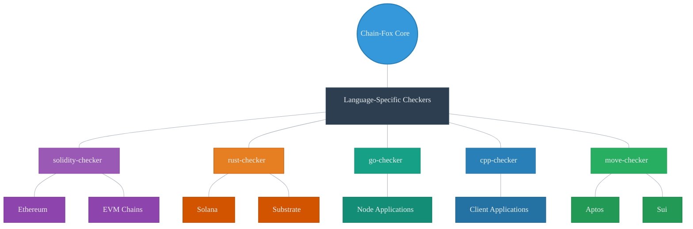

## Key Innovations Compared to Existing Solutions
As the Web3 ecosystem evolves at an unprecedented pace, the scale and complexity of security requirements continue to escalate. Chain-Fox introduces a suite of groundbreaking technical innovations that distinguish it from conventional blockchain security platforms and auditing tools, addressing critical deficiencies in coverage, efficiency, and transparency.

### 2.1 Multi-Language, Full-Stack Vulnerability Detection

Traditional blockchain security tools predominantly focus on Solidity, constraining their utility to Ethereum-compatible smart contracts. Chain-Fox transcends this limitation by delivering comprehensive support for a diverse array of programming languages, including **Solidity, Rust, Go, C++, and Move**. This enables robust security analysis across a broad spectrum of blockchain platforms, such as Ethereum, Solana, Cosmos, Polkadot, Aptos, and Sui.

This multi-language capability is powered by a modular checker architecture, positioning Chain-Fox as a unified, full-stack security solution for development teams operating across heterogeneous blockchain environments. By encompassing the languages and frameworks that underpin modern blockchain protocols, Chain-Fox ensures unparalleled versatility and coverage.

### 2.2 Modular and Specialized Detection Framework

Chain-Fox leverages a **plug-and-play checker framework** with specialized analyzers tailored to each supported programming language:

- **`solidity-checker`**: Optimized for Ethereum-based smart contracts.
- **`rust-checker`**: Engineered for Solana, Substrate, and other low-level blockchain protocols.
- **`go-checker` and `cpp-checker`**: Designed for application-level node and client code.
- **`move-checker`**: Crafted for emerging Move-based ecosystems, including Aptos and Sui.

Each module is independently maintainable and extensible, enabling rapid adaptation to emerging vulnerability classes and evolving language specifications. Unlike generic detection engines, this modular architecture ensures precise, language-specific rule enforcement, delivering superior accuracy and reliability in vulnerability detection.

### 2.3 Fully Automated End-to-End Security Analysis

Chain-Fox redefines the auditing process by providing **fully automated vulnerability detection pipelines**, significantly reducing reliance on manual interventions. This approach dramatically lowers the time and cost associated with traditional smart contract audits, democratizing access to enterprise-grade security for developers, startups, and organizations.

| Approach | Traditional Auditing | Chain-Fox Automated Analysis |
|----------|---------------------|----------------------------|
| **Time to Complete** | Days to weeks | Minutes to hours |
| **Cost Structure** | High fixed costs | Pay-per-use / subscription |
| **Scalability** | Limited by auditor availability | Unlimited, on-demand |
| **Coverage** | Depends on auditor expertise | Comprehensive, rule-based |
| **Consistency** | Varies between auditors | Standardized detection rules |
| **Integration** | Manual, separate process | Seamless CI/CD integration |
| **Adaptability** | Requires re-audit | Continuous monitoring |

The automation framework encompasses:

- **Static Analysis**: Detects syntax and semantic errors with precision.
- **Control and Data Flow Inspection**: Identifies vulnerabilities arising from logic and data handling.
- **Configuration Rule Enforcement**: Ensures adherence to security best practices and standards.
- **CI/CD Integration**: Seamlessly embeds security checks into continuous integration and deployment workflows.

By proactively identifying common and critical vulnerabilities prior to deployment, Chain-Fox enhances the security posture of blockchain ecosystems, enabling faster and more secure development cycles.

### 2.4 Open-Source Transparency and Community-Driven Development

In contrast to proprietary auditing services, Chain-Fox embraces an **open-source** and community-driven model. Its modular detection tools are publicly accessible for inspection, customization, and contribution, fostering trust and collaboration within the developer community. This transparency empowers external contributors to strengthen the platform by:

- Proposing and implementing new detection rules.
- Enhancing existing analyzers to address emerging threats.
- Auditing and verifying the integrity of the detection logic.

This open development paradigm promotes collective responsibility for blockchain security and cultivates a vibrant ecosystem of contributors, ensuring Chain-Fox remains at the forefront of innovation.

### Summary

Through its multi-language support, modular detection framework, end-to-end automation, and open-source governance, Chain-Fox represents a transformative leap forward in blockchain security tooling. By directly addressing critical pain points—such as limited language coverage, protracted audit processes, and lack of transparency—Chain-Fox establishes itself as a next-generation platform for securing decentralized systems. With its commitment to scalability, precision, and community collaboration, Chain-Fox is poised to redefine the standard for blockchain security in the Web3 era.