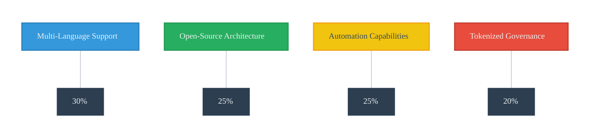

## Competitive Landscape
As the blockchain industry advances, the need for secure, scalable, and cost-effective smart contract auditing solutions has become paramount. A diverse array of auditing tools and platforms has emerged to address this demand, yet many are constrained by limited language support, proprietary frameworks, or high operational costs. ChainFox enters this landscape as a modular, open-source platform, purpose-built for the multi-chain Web3 ecosystem, delivering unparalleled versatility and accessibility.

### 3.1 Market Overview

The current smart contract auditing market can be broadly categorized into two segments:

- **Manual Audit Firms**: Providers such as CertiK and Trail of Bits deliver comprehensive audits leveraging human expertise. While thorough, these services are characterized by high costs and extended turnaround times, making them less viable for rapid development cycles.
- **Automated Analysis Tools**: Solutions like MythX, Slither, and OpenZeppelin Defender offer varying degrees of static analysis and automated vulnerability detection. However, their scope is often limited to Solidity and Ethereum-based applications, leaving significant gaps in supporting the diverse programming stacks of modern blockchains such as Solana, Polkadot, Cosmos, and Aptos.

While these tools excel within their respective domains, they struggle to address the growing complexity and heterogeneity of multi-chain environments, creating a need for a more inclusive and agile security solution.

### 3.2 Comparative Feature Matrix

| Feature / Platform               | **Chain-Fox**                 | CertiK   | MythX    | OpenZeppelin Defender |
| -------------------------------- | ----------------------------- | -------- | -------- | --------------------- |
| **Language Support**             | Rust, Solidity, Go, C++ | Multiple languages | Solidity | Solidity              |
| **Checkers Support**                  | SOTA Static & Dynamic checkers & Verifiers | Tools and Human Auditors     | Fuzzer       | Smart Contracts Audit        |  Partial               |
| **Open Source**                  | ✅                             | ❌        | ❌        |  Partial               |
| **CI/CD Integration**            | ✅                             | ❌        | ✅        | ✅                     |
| **Community Contribution**       | ✅                             | ❌        | ❌        | ❌                     |
| **Tokenized Governance**         | ✅ (CFX DAO)                   | ❌        | ❌        | ❌                     |
| **Free Tier / Developer Access** | ✅                             | ❌        | ✅        | Partial               |

### 3.3 ChainFox’s Strategic Advantages

ChainFox is meticulously engineered to meet the needs of next-generation multi-chain decentralized applications (dApps) and infrastructure developers. Its competitive edge is anchored in the following differentiators:

| Strategic Advantage | Key Benefits |
|-------------------|-------------|
| **Multi-Language Support** | Enables security analysis across diverse blockchain ecosystems |
| **Open-Source Architecture** | Facilitates community-driven innovation and customization |
| **Automation Capabilities** | Streamlines security processes and enhances development velocity |
| **Tokenized Governance** | Aligns incentives and promotes sustainable ecosystem growth |

- **Comprehensive Multi-Language Support**: By natively supporting **Solidity, Rust, Go, C++, and Move**, ChainFox ensures robust security analysis for a wide range of blockchain protocols beyond Ethereum, including Solana, Polkadot, Cosmos, Aptos, and Sui. This versatility positions ChainFox as a future-proof solution for diverse development stacks.
- **Open-Source and Modular Design**: ChainFox’s community-driven, open-source model, combined with its modular checker architecture, enables rapid evolution and the deployment of custom detection rules. This flexibility ensures the platform remains agile in addressing emerging threats and ecosystem requirements.
- **Automation-Centric Approach**: Designed for seamless integration into CI/CD pipelines, ChainFox delivers real-time, automated vulnerability detection, eliminating manual bottlenecks. This scalability empowers developers to maintain continuous security without compromising development velocity.
- **Incentive-Aligned Governance**: Through the **CFX token** and its decentralized autonomous organization (DAO), ChainFox fosters active participation from developers, node operators, and security researchers in ecosystem governance. This tokenized model aligns incentives, promoting collaborative innovation and long-term platform sustainability.

### Conclusion

While competitors offer either depth or breadth in isolation, ChainFox uniquely integrates automation, extensibility, multi-language support, and decentralized governance into a cohesive platform. Its open-source ethos and modular architecture establish a new benchmark for trustless, real-time blockchain security. By empowering developers to secure decentralized applications across diverse blockchain ecosystems, ChainFox is poised to lead the charge in building a safer and more resilient Web3 future.