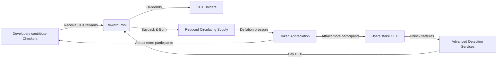

## **4. Tokenomics & Ecosystem Incentive Architecture**

Chain-Fox adopts a utility-driven token model that aligns platform usage, open-source contribution, and stakeholder governance into a sustainable economic loop. The CFX token functions not just as a payment mechanism, but as a representation of rights, incentives, and long-term participation in the security infrastructure ecosystem.

---

### **4.1 Core Utilities of the CFX Token**

CFX is designed to fulfill three key functions across the ecosystem:

* **Open-Source Incentives**
  Developers contribute new detection modules (Checkers) and receive CFX rewards from a dedicated incentive pool. High-quality tools gain repeated usage and compounding returns.

* **Service Access & Staking**
  Users stake CFX to unlock advanced detection features, including multi-chain contract scanning, OS-level threat monitoring, and AI-assisted risk profiling. Staking also entitles users to receive protocol-based yield, sourced from service revenue.

* **Governance & Dividends**
  CFX holders participate in key governance decisions — such as support for new chain integrations, security policy updates, and treasury deployment — and share in protocol profits via a revenue-sharing mechanism.

---

### **4.2 Economic Loop & Deflation Mechanics**

The CFX economy is built on a positive feedback loop between developers, users, and token holders:

This loop ensures:

* Incentives for continuous development
* Locked token supply through staking
* Deflation through burn mechanisms
* Long-term alignment between usage and value capture

---

### **4.3 Stakeholder Incentive Model**

#### **Developers**

* Earn CFX by contributing detection modules
* Passive yield as their tools are reused across the ecosystem
* Long-term value accrual through staking + governance access

#### **Users**

* Stake CFX to unlock premium services
* Earn staking rewards during lock-up periods
* Contribute to token scarcity by locking tokens in non-circulating pools

#### **Investors**

* Benefit from dual-value drivers:

    * **Yield participation** from protocol revenue
    * **Token appreciation** via reduced circulating supply and usage growth
* Reduced sell pressure via long-term staking commitments

---

### **4.4 Innovation Highlights in Token Design**

* **Token = Equity**
  CFX represents both platform access and governance influence — moving beyond the “utility token” mold into functional digital equity.

* **Ecosystem Flywheel**
  Developer participation leads to more detection tools → Attracts more users → Increases demand for staking & payments → Recycles value to developers

* **Risk-Adjusted Rewards**
  A portion of staking returns can be redirected to insurance or buyback funds during security incidents, stabilizing the system during volatility.

---

### **4.5 Recommendations for Execution**

To operationalize this model, we suggest:

* **Transparent Allocation Plan**
  (e.g., open-source incentive pool, staking pool, team, and liquidity reserves)

* **Tiered Staking Mechanism**
  Dynamic yield and service access based on staked amount and lock duration

* **DAO Governance Modules**
  Allow token holders to vote on:

    * New chain/system support
    * Rule updates
    * Grant approvals for ecosystem development
