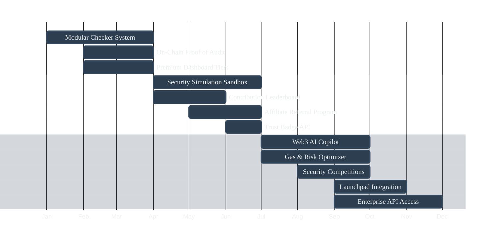
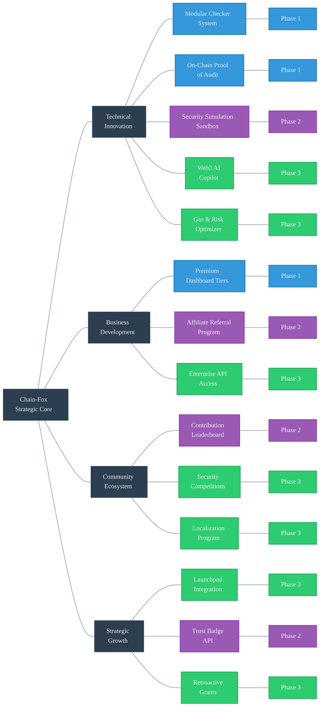
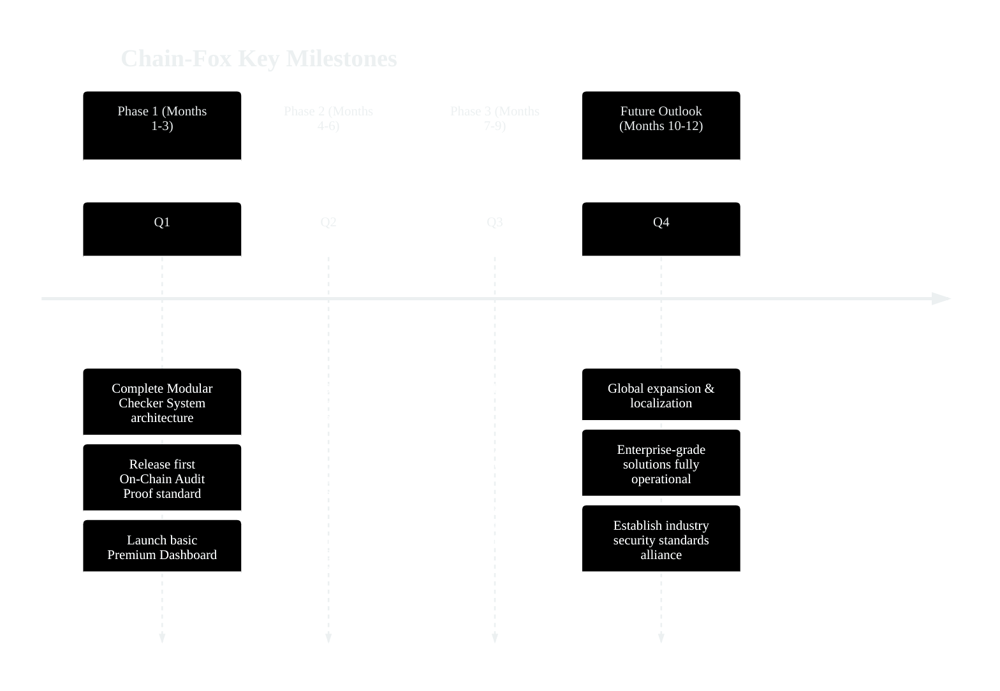

## Chain-Fox Development Roadmap

### Phase 1: Foundation & Core Development (Month 1–3)

#### Platform Initialization
- Add AI Agent for automated vulnerability detection
- Add browser extension for real-time on-site analysis
- Make backend infrastructure extensible to handle scale and demand
- Launch early access trial with scanning of critical blockchain protocols

#### Checker & Token Integration
- Upgrade all checkers to latest toolchain versions
- Launch dynamic checkers for common contract types
- Integrate CFX token for payments, staking, and community rewards

#### Efficiency & Usability Enhancements
- Implement cached database for optimized performance
- Introduce AI-assisted filtering and automated report generation

### Phase 2: Ecosystem Expansion & Threat Intelligence (Month 3–6)

#### Community & Company Formation
- Launch Chain-Fox Security Company for consulting and audits
- Connect checker developers with users for custom tools
- Onboard certified auditors for advanced user requests

#### Supply Chain & Full-Stack Security
- Begin monitoring supply-chain attacks across blockchain ecosystems
- Expand scanning to include non-blockchain systems like operating systems and databases
- Launch centralized technical documentation and integration hub

#### Smart Automation & Network Intelligence
- Develop AI-driven auto-patch suggestions for identified vulnerabilities
- Deploy anomaly-based zero-day detection system
- Launch a threat intelligence network with community opt-in data sharing

### Phase 3: Developer Tools, Community, and Monetization (Month 6–9)

#### Developer Enablement
- Release Chain-Fox SDK for external integrations
- Launch IDE plugins (VSCode, JetBrains) for inline threat alerts
- Add live playground for testing and debugging custom checkers

#### Access, Mobile, and API
- Develop and release the Chain-Fox mobile app for alerts and monitoring
- Open multi-chain threat intelligence API to developers and partners
- Offer audit subscription packages with priority support and scanning

#### Community Building & Education
- Launch bug bounty program for responsible disclosures
- Establish Chain-Fox University with structured Web3 security education
- Roll out Chain-Fox Ambassador Program to drive regional growth
- Open security marketplace for audit tools, checkers, and services

## Key Strategic Initiatives

### Strategic Development Timeline

### Strategic Core Areas

### Core Strategic Details

#### 1. Technical Innovation Strategy

| Priority | Initiative | Phase | Expected Outcome | Key Performance Indicators |
|:---:|---------|:---:|---------|---------|
| 🔴 | **Modular Checker System** | 1 | Users integrate only checkers relevant to their tech stack (EVM, Solana, Rust, etc.) | • Number of supported blockchain platforms • Number of checker modules • Number of user-defined checkers |
| 🔴 | **On-Chain Proof of Audit** | 1 | Verifiable audit badge (NFT or metadata) after successful scan | • Number of audit proofs issued • Adoption rate in DeFi projects • Frequency of public verification |
| 🟠 | **Security Simulation Sandbox** | 2 | Emulated environments for testing against known exploits | • Number of vulnerability types supported • Number of vulnerabilities successfully prevented • Simulation test completion time |
| 🟢 | **Web3 AI Copilot** | 3 | Real-time IDE integration with natural language risk explanations | • User adoption rate • Problem resolution accuracy • User satisfaction rating |
| 🟢 | **Gas & Risk Optimizer** | 3 | Secure and gas-efficient contract code improvements | • Average Gas savings percentage • Optimization suggestion adoption rate • Reduction in security issues after optimization |

#### 2. Business Development Strategy

| Priority | Revenue Stream | Phase | Features | Strategic Value |
|:---:|---------|:---:|---------|---------|
| 🔴 | **Premium Dashboard Tiers** | 1 | • Advanced Analytics • Custom Scanning Frequency • Historical Trends | • Monthly recurring revenue growth • Premium user retention rate • Average revenue per user |
| 🟠 | **Affiliate Referral Program** | 2 | • CFX Token Rewards • Revenue Sharing Mechanism | • Referred user growth rate • Number of affiliate partners • Percentage of revenue generated through affiliates |
| 🟢 | **Enterprise API Access** | 3 | • SLA-backed APIs • High-throughput Access • Institutional Integration | • Number of enterprise clients • API call volume • Enterprise contract renewal rate |

#### 3. Community Ecosystem Strategy

| Priority | Initiative | Phase | Implementation | Expected Impact |
|:---:|---------|:---:|---------|---------|
| 🟠 | **Contribution Leaderboard** | 2 | Public rankings for checker developers with rewards | • Number of community contributors • Contribution quality score • Number of community-developed checkers |
| 🟢 | **Security Competitions** | 3 | Coding events focused on security tool development | • Number of participants • Number of innovative solutions produced • Community engagement growth |
| 🟢 | **Localization Program** | 3 | Translation of platform and docs into key languages | • Number of supported languages • Growth rate of non-English users • Market penetration in different language regions |

#### 4. Strategic Growth Plan

| Priority | Strategy | Phase | Implementation Method | Strategic Value |
|:---:|---------|:---:|---------|---------|
| 🟢 | **Launchpad Integration** | 3 | Partner with token launch platforms to require Chain-Fox audits | • Number of launchpad partnerships • Number of projects acquired through launchpads • Degree of industry standard establishment |
| 🟠 | **Trust Badge API** | 2 | Embeddable live audit status for DeFi/NFT project websites | • Number of projects adopting the trust badge • Badge click/verification count • User trust improvement |
| 🟢 | **Retroactive Grants** | 3 | Rewards for open-source contributors whose tools benefit Chain-Fox | • Total grants distributed • Number of projects/developers benefited • Community reputation enhancement metrics |

### Key Milestones & Objectives

